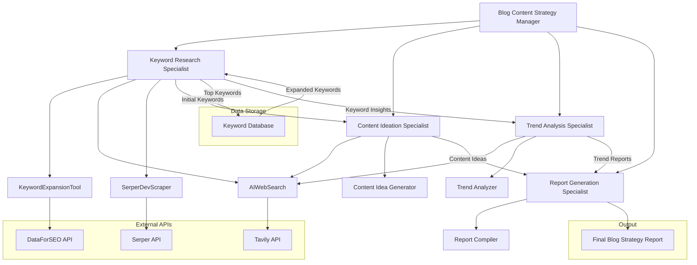
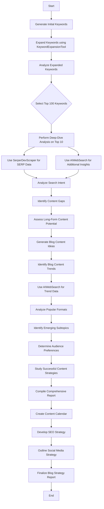

# Blog Content Research Crew

Welcome to the Blog Content Research Crew project, powered by [crewAI](https://crewai.com). This project leverages a multi-agent AI system to streamline and enhance blog content research, keyword analysis, and content strategy development.

## Project Overview

The Blog Content Research Crew automates the process of creating effective blog content strategies through the following steps:

1. Generating initial keywords related to a specific blog niche
2. Expanding and analyzing these keywords to identify top performers
3. Conducting deep-dive analysis on the most promising keywords
4. Creating blog content ideas based on the keyword research
5. Identifying current trends in the blog niche
6. Compiling a comprehensive blog strategy report

This system aims to provide valuable insights and actionable recommendations for blog content creation and optimization, saving time and enhancing the quality of content strategies.

## System Design

The Blog Content Research Crew is designed as a multi-agent system, with each agent specializing in specific tasks. Here's a detailed overview of the system architecture:



*Note: This diagram uses Mermaid syntax. If it doesn't render in your Markdown viewer, you can copy the code and paste it into the [Mermaid Live Editor](https://mermaid-js.github.io/mermaid-live-editor/) to view the diagram.*

## Activity Diagram

The following detailed activity diagram outlines the process flow of the Blog Content Research Crew:



*Note: This diagram uses Mermaid syntax. If it doesn't render in your Markdown viewer, you can copy the code and paste it into the [Mermaid Live Editor](https://mermaid-js.github.io/mermaid-live-editor/) to view the diagram.*

## Installation

Ensure you have Python >=3.10 <=3.13 installed on your system.

1. Install Poetry:
   ```bash
   pip install poetry
   ```

2. Install project dependencies:
   ```bash
   crewai install
   ```

3. Rename `.env.example` to `.env` and set the environment variables:

   ```
   TAVILY_API_KEY="NA" #Get one for free 👉  https://tavily.com
   SERPER_API_KEY="NA" #Get one for free 👉 https://serper.dev/

   DATAFORSEO_LOGIN="NA" #Get 1$ worth of credit for free 👉 https://dataforseo.com/
   DATAFORSEO_PASSWORD="NA"

   # Remote Server model setup.
   OPENAI_API_BASE="https://api.openai.com/v1"
   OPENAI_MODEL_NAME="chatgpt-4o-latest"
   OPENAI_API_KEY="NA" #Create your own 👉 https://platform.openai.com/

   #Local ollama model setup.
   #OPENAI_API_BASE="http://localhost:11434/v1"
   #OPENAI_MODEL_NAME="ollama/mistral"
   #OPENAI_API_KEY="NA"
   ```

   Replace "NA" with your actual API keys.

## Running the Project

1. Define your blog niche:
   Open `src/niche/main.py` and locate the `initial_topic` variable. Set it to your desired blog niche or topic. This will be used as the starting point for the keyword research and content strategy development.

2. Start your Blog Content Research Crew:
   ```bash
   crewai run | tee logs.txt
   ```

This command initializes the crew, assigns tasks to agents, and begins the research process. The output will be saved in two files:
- `blog_strategy_report.md`: The comprehensive blog strategy report
- `logs.txt`: A log of the entire process

## Using Ollama (Local Model)

To use a local Ollama model instead of OpenAI's API:

1. Install Ollama from [Ollama's official website](https://ollama.ai/).

2. Create the Mistral model:
   ```bash
   ./setup/create-mistral-model.sh
   ```

3. Update your `.env` file:
   ```
   OPENAI_API_BASE="http://localhost:11434/v1"
   OPENAI_MODEL_NAME="ollama/mistral"
   OPENAI_API_KEY="NA"
   ```

   Comment out the remote server model setup lines.

## Customization

Modify the following files to customize the crew for different blog niches or content types:
- `src/niche/config/agents.yaml`: Adjust agent roles and capabilities
- `src/niche/config/tasks.yaml`: Modify task descriptions and expected outputs

Adjust the initial topic, keyword focus, or analysis criteria to suit your specific blog content needs.

## Understanding Your Crew

The Blog Content Research Crew consists of several specialized AI agents, each with specific roles in the content research and strategy development process. These agents collaborate to generate keywords, analyze trends, create content ideas, and compile strategy reports.

Leverage the power of AI to revolutionize your blog content strategy with the Blog Content Research Crew!